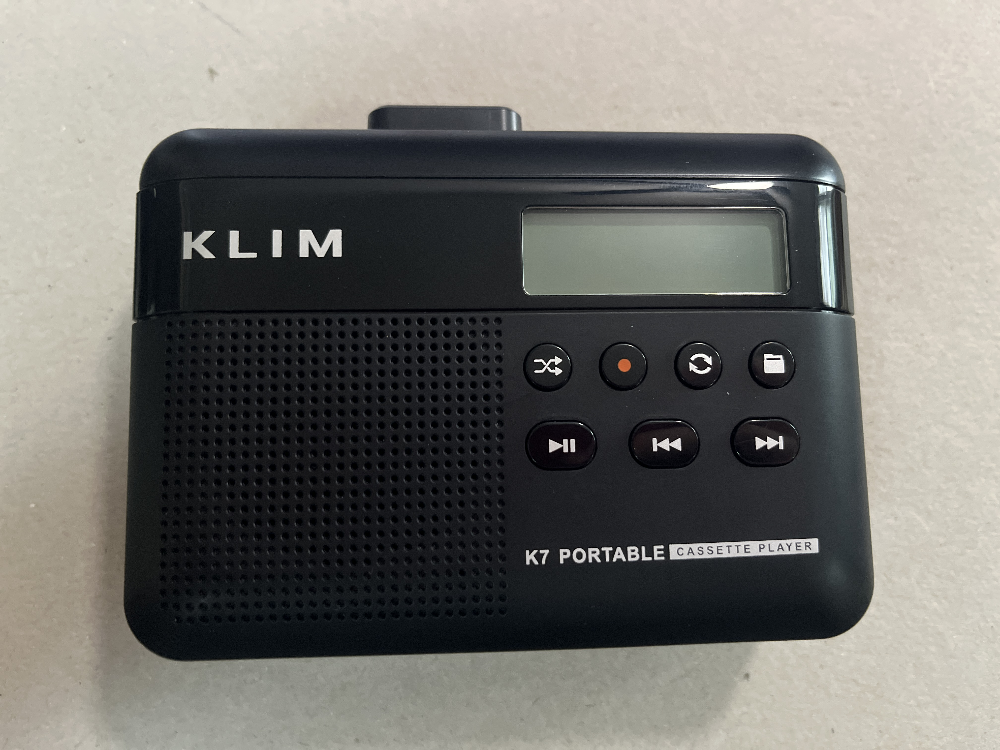
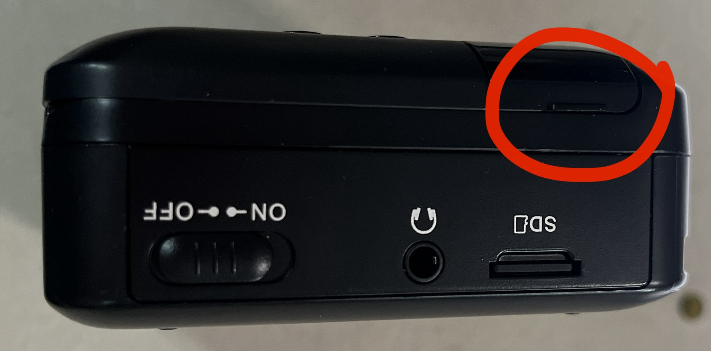
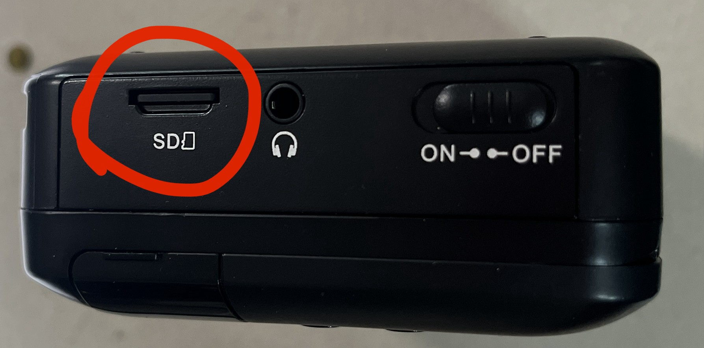
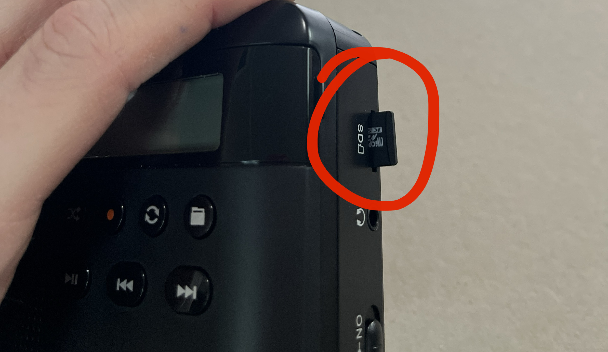
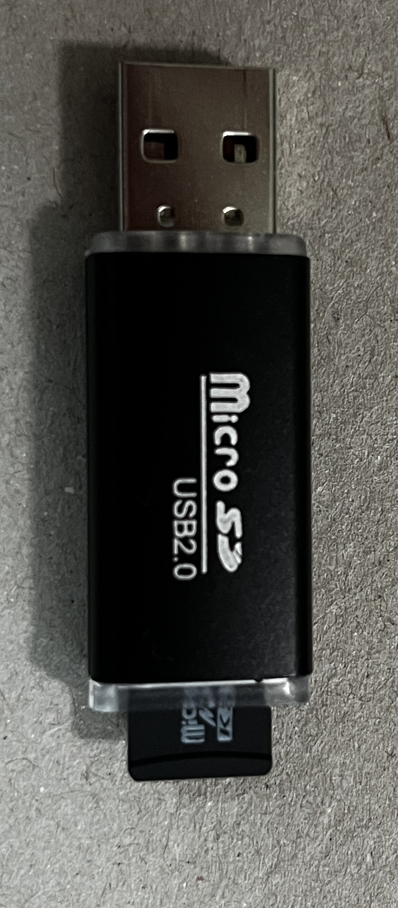

## Introduction 

Out of the total \~7,000 hours of PAM data, \~2,600 hours were recorded using cassette tapes. Cassette tapes are not a reliable analog format. Cassettes will degrade with time, which is why it's critical that we preserve the PAM data in a digital format before the cassette tapes are no longer able to be digitized! Having a fully digitized PAM dataset which was consistently collected for 25 years will provide important basic knowledge on nocturnal vocalizing taxa for conservation management initiatives.

## Using the portable cassette player

We use portable cassette players to digitize the cassette tapes. These are handheld and seem to do a good enough job at preserving frequency with its corresponding acoustic signal.

The cassette player plays the tape in real time (e.g., if the tape is 30 minutes long, it will take 30 minutes to digitize) and records the output onto an sd card. Below are some common features of the player:

## Digitization Steps 
