## Introduction

A substantial portion of the long‑term PAM archive—\~2,600 of \~7,000 total hours—was originally recorded on cassette tapes. Because cassette tapes are an inherently unstable analog medium, they degrade over time. This makes it urgent to digitize the remaining recordings before they reach a point where high‑fidelity transfer is no longer possible. Fully digitizing this 25‑year PAM dataset will save one of the few continuous acoustic records of nocturnal vocalizing insects. Such a dataset will provide baseline ecological knowledge essential for conservation management, long‑term monitoring, and understanding how nocturnal insect communities respond to land‑use and climate change.

## Using the portable cassette player

We use portable cassette players to digitize the cassette tapes. These are handheld and seem to do a good enough job at preserving frequency with its corresponding acoustic signal and species.

The cassette player plays the tape in real time (e.g., if the tape is 30 minutes long, it will take 30 minutes to digitize) and records the output onto an sd card. Each cassette side is approximately 40 minutes. A 20-25 hour/week position should complete \~ 20 cassettes per week, give or take 1-2 cassettes. Double this number when running two cassette players at once, which is expected once you get used to the process. Below are some common features of the player:

## Digitization Steps

### 1. Record the metadata for each tape

One of the most important components of this project is organization. **We need to account for every single day and sampling period.** Record everything that you are doing, or need to remember in order to account for every tape (both sides). You will be supplied with an online datasheet and organized boxes to keep organized.

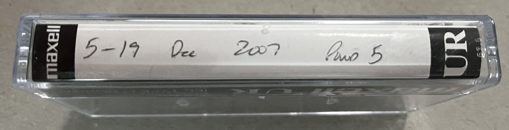

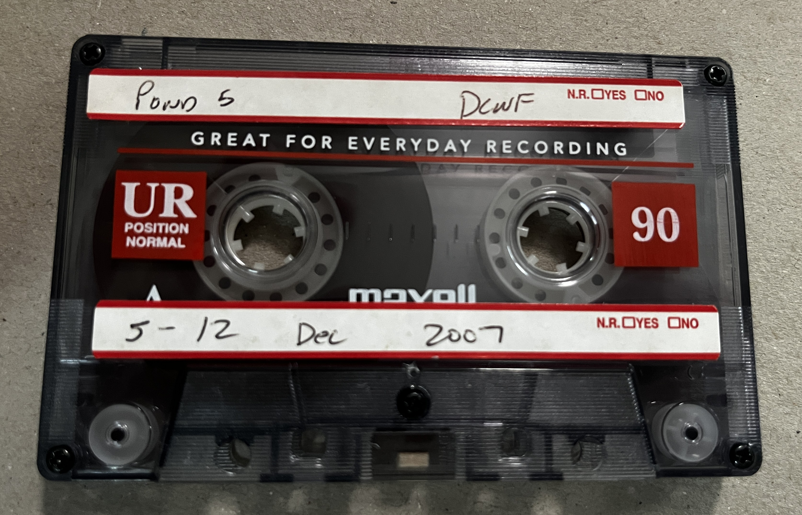

For each tape write down the following information in the [project datasheet](https://docs.google.com/spreadsheets/d/1hWTq60_fqj_c8tuf1j0HKcRtZBuAiiTWmOeOkW6RYlM/edit?usp=sharing):

- Cassette *year-month-day*

- Digitized? (*yes* - once it is digitized)

- Notes (if necessary)

This datasheet and other resources for the project can be found in the [project's google drive](https://drive.google.com/drive/folders/1AA-JOCykTJeGSYroZbn8_ZZ2O4xQYKov?usp=sharing).

### 2. Insert the cassette tape

Insert the tape (thin side down) into the cassette player and make sure the tape is between the two brackets.

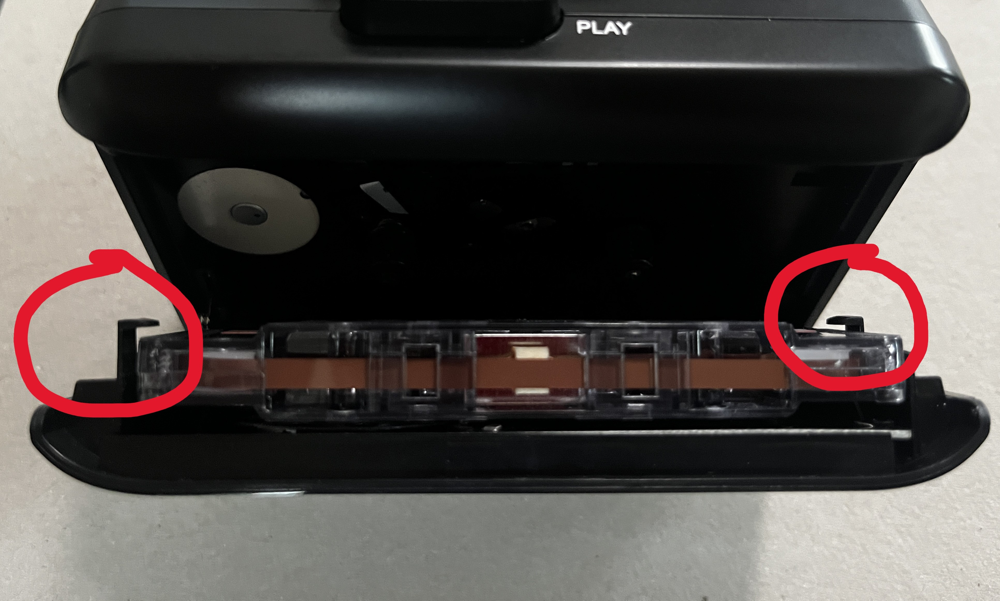

### 3. Rewind or fast forward the tape to the beginning

Before playing the tape, make sure that the tape is fully rewound and fast forwarded. The tape roll on the right of the cassette will start when the play button is pressed.

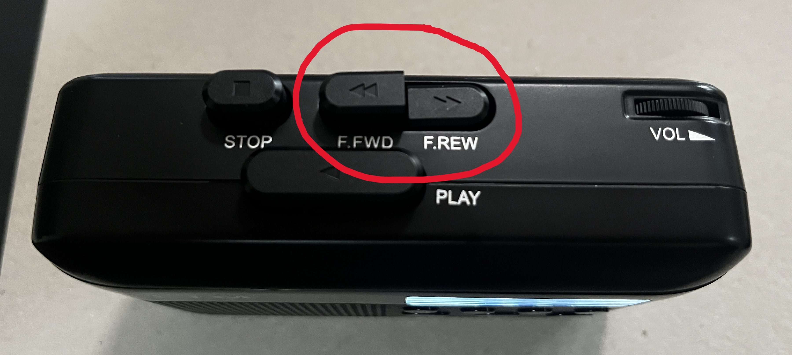

### 4. Press play and record

Press play. Wait until you here a voice that will say the day and time. You can adjust the volume on the top of the player, or use headphones. The headphone jack is next to the on/off button.

Once you hear the voice which indicates the date and time, immediately hold in the record button until you see `REC` on the right side of the screen. Ensure that the recorder is charged at all times. DO NOT start a recording at 1 bar of battery - plug it in and start the recording. If the recorder stops or dies mid-recording, you will need to start over - delete the partially digitized MP3 file. We want two recordings (front and back) per cassette.

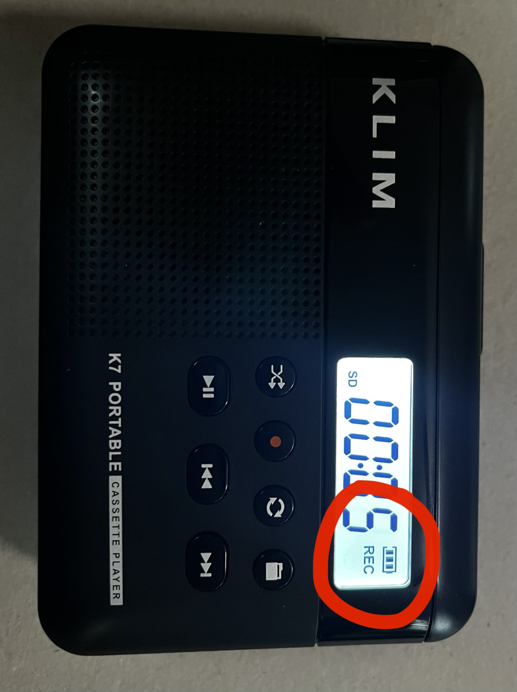

The tape will play for \~ 40-50 minutes. Maybe \~35 minutes of that will actually be passive acoustic monitoring (PAM) data and the rest will be left over tape. Once the end is reached, flip the tape around and repeat the process.

### 5. Verify and rename the recording

5a. I recommend running through no more than 4 cassette tapes (8 MP3 filts) before renaming the files and filling out the online datasheet. Attach the microsd card to the thumbdrive and connect it to a computer with RavenPro. {width="50"}

This tutorial already assumes that the user knows the basics of RavenPro. If not, please see the **Introduction to RavenPro** section of these docs.

5b. Open the recording in RavenPro, which will be automatically saved in the microsd card as "TAPE##".

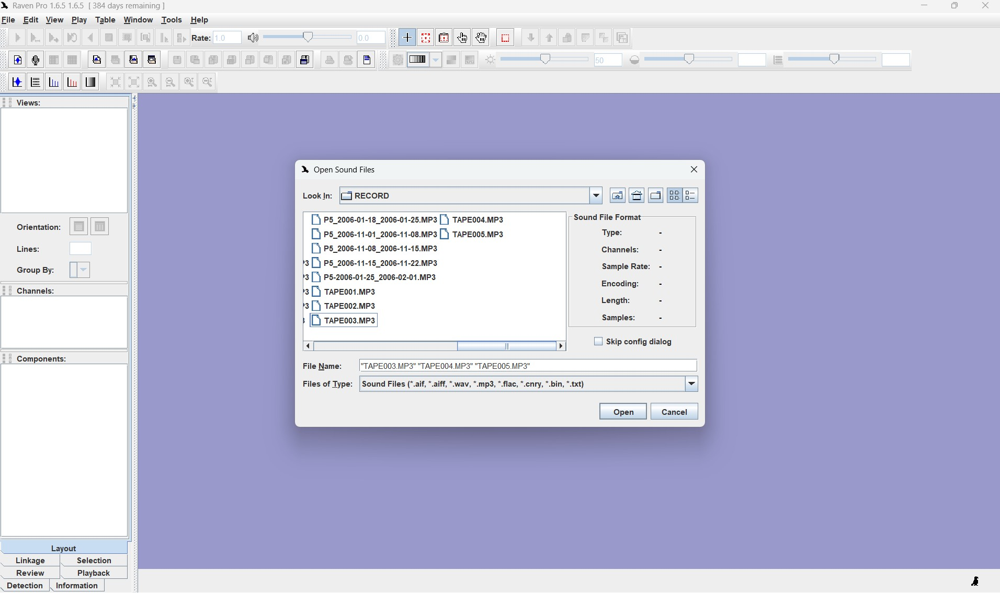

Since the cassette tapes hold multiple days of data, the recording will have multiple indicators (the voice of the Orthopteran god that tells us the date and time in the recording). Each broadband signal spanning 0-10 kHz is likely the voice indicator.

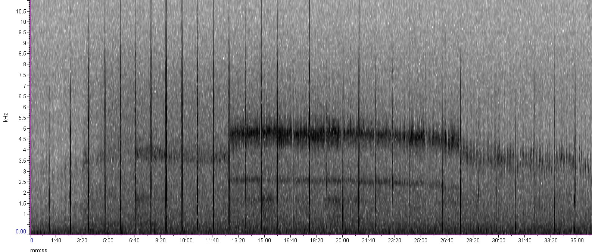

5c. Zoom in and listen to the first and last indicator to make sure all the dates listed on the tape/tape case are included. These date stamps should occur every minute in the recording.

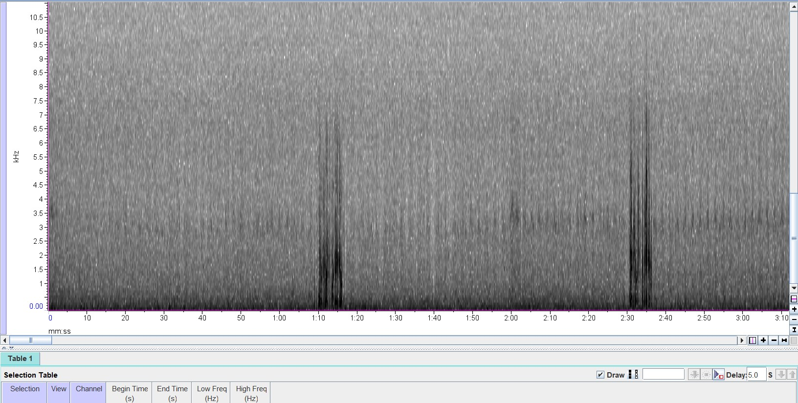

5d. Once the recording has been verified, name the corresponding file as *site_date#1_date#2* listed in the file.

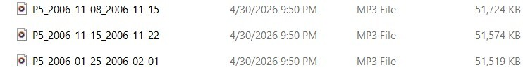

#### **IMPORTANT**: It is absolutely crucial to use standard formatting, and that the dates listed in the file name match the data in the file. Things can get disorganized very quickly considering that we have the same date for multiple years and sites, and that the voice of the Orthopteran god does not explicitely say the year or site in the recording. (1) All cassettes stay with their corresponding case and (2) check the recording to make sure it was digitized properly before moving on to the next batch and/or recording the information in the datasheet.

[Any discrepancies will result in multiple cassettes having to be re-digitized—that is if we are able to find what is missing. It would involve digging through multiple boxes filled with hundreds of cassette tapes.]{.underline}

### 6. Add the metadata in the datasheet and mark digitized on the cassette tape

Once the recording has been verified and correctly named, mark "yes" under "Digitized (y/n):" in your notes. Move on to the next cassette tape.

As a second form of verification and organization we will write the digitization date and the initials of the person that digitized the tape on the back of the case only after verifying that the recording we digitized properly and renamed, and the metadata added to the datasheet.

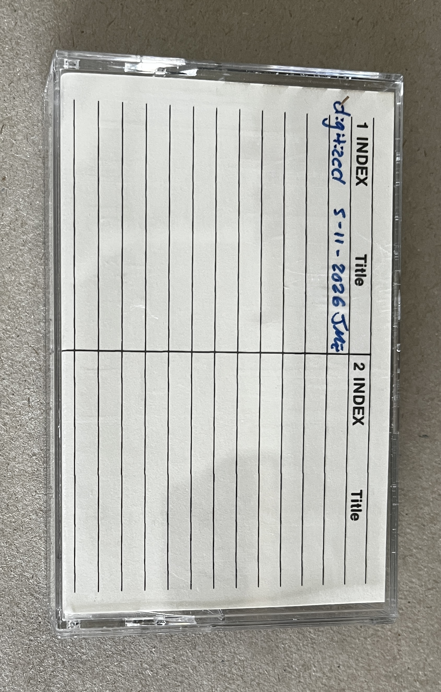

### 7. Transfer files for long-term storage

Transfer the files from the cassette player thumb drive to the larger storage hard drive kept in the lab. Once you are sure that the files transferred completely, delete the files from the cassette play thumb drive.

All cassette tapes that are successfully digitized will be placed in their own separate box that will be organized by site #. The same will be done for cassettes that had issues. We will digitize all the cassettes for a site before moving on to the next site.

## Issues with cassette tapes

Some of these cassette tapes will have issues. If this issues persist which results in the tape not being able to be digitized, (1) make sure the tape does not stay in the datasheet and especially make sure that this tape does not get marked as "yes" under "digitized? (y/n)" or on the tape itself; (2) insert a piece of paper in the case that says "issue" - and briefly describe the issue.

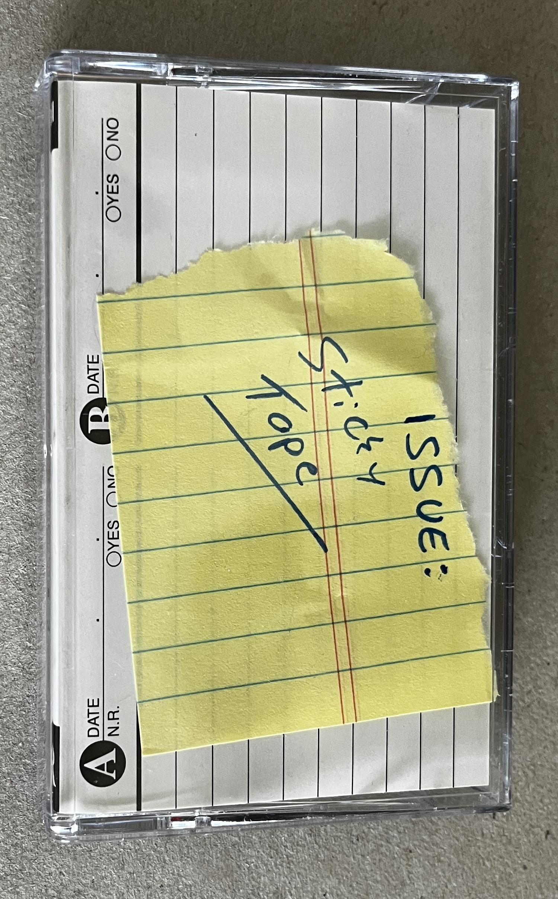

### a. Sticky tapes

Most commonly the cassette tapes might play very slowly, or might not play at all. If this occurs you could try fast forwarding or rewinding a couple seconds to unstick the tape or manually turning the tape a little. If the issue persists, mark the tape with a piece of paper detailing the issue and store it separate from the digitized tapes.

### b. Issues opening the recording in RavenPro

i\. *The file is corrupt or unreadable*. Before placing the cassette tape with others that have issues, try restoring the thumb drive. This issue is common if you don't properly eject the thumb drive before removing it from the computer.

ii\. *RavenPro is having issues opening the file due to storage capacity*. Try restarting RavenPro—this is often the fix.

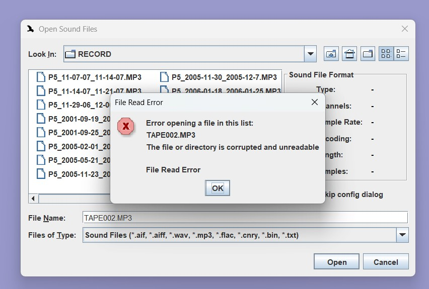

### 8. Transfer cassette tapes for long-term storage

All cassette tapes that are successfully digitized will be placed in their own separate box that will be organized by site #. The same will be done for cassettes that had issues. We will digitize all the cassettes for a site before moving on to the next site.

