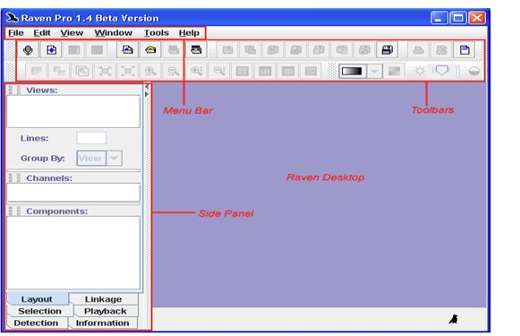
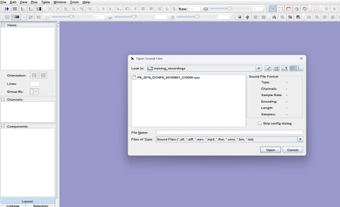
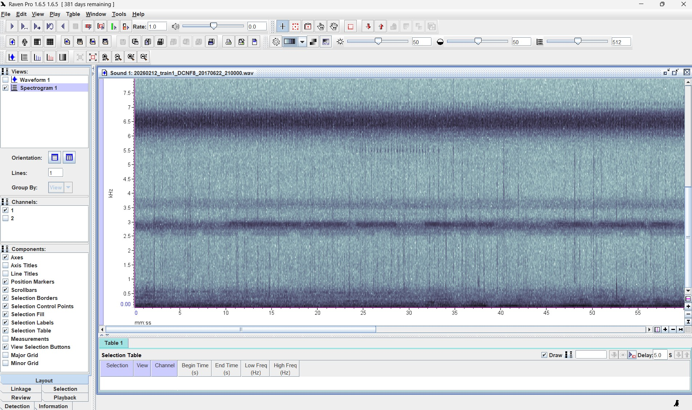
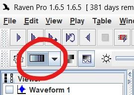
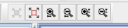
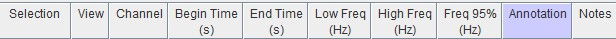
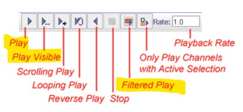
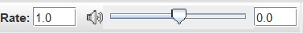
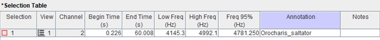
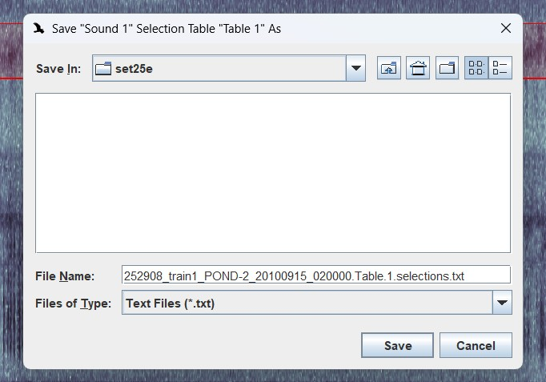

# Getting started in RavenPro

Raven Pro is a software program for the acquisition, visualization, measurement, and analysis of sounds developed by the [K. Lisa Yang Center for Conservation Bioacoustics](https://www.birds.cornell.edu/ccb/raven-pro/) at the Cornell Lab of Ornithology. Open RavenPro, which will have an a desktop icon like this: {width="60"}

RavenPro should open to a blank workbench (Figure 1).

There are many components and configurations for the RavenPro software. Included in these docs are the main components that we’ll use. For a more detailed tutorial of RavenPro, please see its [user manual](https://ravensoundsoftware.com/wp-content/uploads/2017/11/Raven14UsersManual.pdf).

# Importing sound files

Annotators will receive learning sets of recordings inside a hard drive titled *Cricket Recordings/Annotations_S26*. Each annotator will have a directory with their name. Inside their named directory will be a list of recordings specifically assigned to them. For now navigate to the directory *learning_recordings* with labeled directories *t1-t4.*

To open a recording, click `file` \> `open sound recordings` and navigate to the directory with your training recordings—they’ll be *.wav* format (Figure 3).

Do not alter any default settings. Click `continue`. The original file will show doubles of the recording, and the waveform and spectrogram. Uncheck channel 2 on the side panel. Note: sometimes channel 2 has a much stronger signal than channel 1. If this is the case use channel 2.

# Spectrogram and waveform

The **spectrogram** is the primary panel that we’ll view when a sound file is played. The spectrogram represents the frequency of the calls (y-axis) across time (x-axis). The color of the call in the spectrogram represents the power (energy) emitted in the recording at each point in time. The color can be changed—black/white/gray tones might be the easiest to work with.

The **waveform** displays an oscillogram showing amplitude (y-axis) across time (x-axis). This will be extremely useful for similar sounding Orthopterans. We can use the oscillogram to view chirp and pulse rate—the time between chirps (ch/s) and between pulses in a single chirp (ps/ch) which might be important for IDs. More on this later!

{fig-align="right"}

# Color and zoom settings

There are different colors available to view the spectrogram. The grayscale or jet (default) option might be the easiest/most consistent color to use.

Zoom the spectrogram window as needed. This isn’t mandatory but is reccomended since some species might need to be boxed in sections if their calling is inconsistent; the same species' signal spaced more than 3 seconds apart from each other.

# Selection table

Editing the selection table is critical for annotating acoustic signals for this project. (1) right click the empty space next to the table columns and choose add annotation column; (2) name one column ***Annotation*** and another ***Notes.*** Keep both case sensitive. ***Annotation*** will recieve your primary ID. ***Notes*** will receive the alternative ID (if applicable).

Click on the right of the selection table and choose Measurements. Add ***95% Frequency*** to the table. The low and high frequency which corresponds to the species ID will vary depending on the person annotating. The ***95% Frequency*** column will account for individual differences between annotators.

If you need to delete a selection, right click the selection in the table and choose ***Clear Active Selections***.

# Play sound in RavenPro

The controls for playing sound are located on the top toolbars (Figure 2). `Play` will start playing the recording continuously until paused. `Play Visible` will play the entire frequency range within the time series window. As the sound plays, a line moves across the spectrogram and waveform. For more information see the RavenPro manual, but we will mostly use `Play Visible` and `Filtered Play`. Once a signal is boxed, we can use `Filtered Play` to omit any sound that occurs outside of our selected box and then when we select `Play Visible`, it will only play the boxed signal. [This workflow is essentially the primary tools you will need to listen and isolate sound to make an accurate ID. We will revisit this on the **Tutorial** page.]{.underline}

Recordings can be quieter than the sample recordings online, that are used to ID. Its recommended to turn up the volume within RavenPro and keep the volume at a reasonable level on the computer so that you don't blow your eardrums every time you switch between software!

# Annotate acoustic signals

Use the selection tool to draw a box around an acoustic signal. The box should be drawn using the selection tool `+` located on the top toolbar.

{width="195"}

Once a box is drawn around a signal, press `enter`. A popup box will appear—either press `enter` again and create an empty selection in the selection table, or directly enter the ID and alternative ID, if necessary, and then press `enter` to add to the selection table.

When entering an ID, put the primary ID in the **Annotation** column and the secondary ID—if there is one—in the **Notes** column. IDs should be formatted as *Genus_species*—case sensitive. If there are more than one alternative ID, format the entry *Genus_species_or_Genus_species*.

At the lower frequencies the alternative ID might sometimes be *frog*. Some toad and *Oecanthus* species sound similar. If you're unsure of the specific species it's okay to only enter the genus. For instance, *Oecanthus* is almost always just entered as *Oecanthus*. The species in this genus have very similar stridulation patterns in the same frequency range. For more on this, continue to the **Tutorial** page.

# Saving a selection table

Finally, to save a selection table navigate to `file` \> `Save "Sound 1" selection table (table 1) as` and leave the name as default. The default should be the exact same name as the corresponding sound file but with \~*Table.1.selections.txt* attached to the end.

