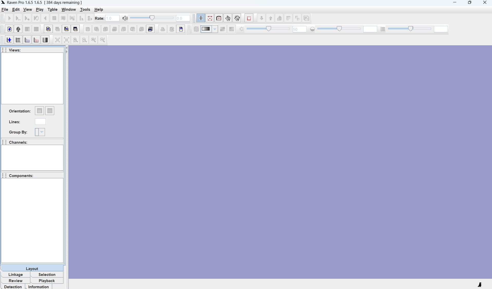

## Getting started in RavenPro

Raven Pro is a software program for the acquisition, visualization, measurement, and analysis of sounds developed by the [K. Lisa Yang Center for Conservation Bioacoustics](https://www.birds.cornell.edu/ccb/raven-pro/) at the Cornell Lab of Ornithology. Open RavenPro, which will have an a desktop icon like this: {width="60"}

RavenPro should open to a blank workbench (Figure 1).

There are many components and configurations for the RavenPro software. Included in these docs are the main components that we’ll use. For a more detailed tutorial of RavenPro, please see its [user manual](https://ravensoundsoftware.com/wp-content/uploads/2017/11/Raven14UsersManual.pdf).
