# Tutorial for annotating Orthopteran stridulations

This tutorial assumes that the user has general knowledge of RavenPro. If not, please see the **Introduction to RavenPro** page for more information. To start:

1.  Import a sound file.
2.  Create an **Annotation** and **Notes** column in a selection table.
3.  Add the **95% Frequency** column to the selection table.

# General Workflow

The tutorial will run through the [first file (download here)](https://drive.google.com/file/d/1wS8jbPxy9n4_jL7N-6o8GTGuOn_l0mT6/view) of the first set of learning material. Open the file from our training folder and reference the supplied help—**ID Key** page and the [Orthoptera Call Guide](https://docs.google.com/spreadsheets/d/1klMWGWtpvWHylVUaaB9nnBOiFvXm6wb4ZrrdUU_eoO0/edit?usp=sharing)—while going through the tutorial.

## 1. Box a call

Use the selection tool to draw a box around a suspected Orthopteran stridulation. Omit the reverberations and include only the strongest parts of the signal.

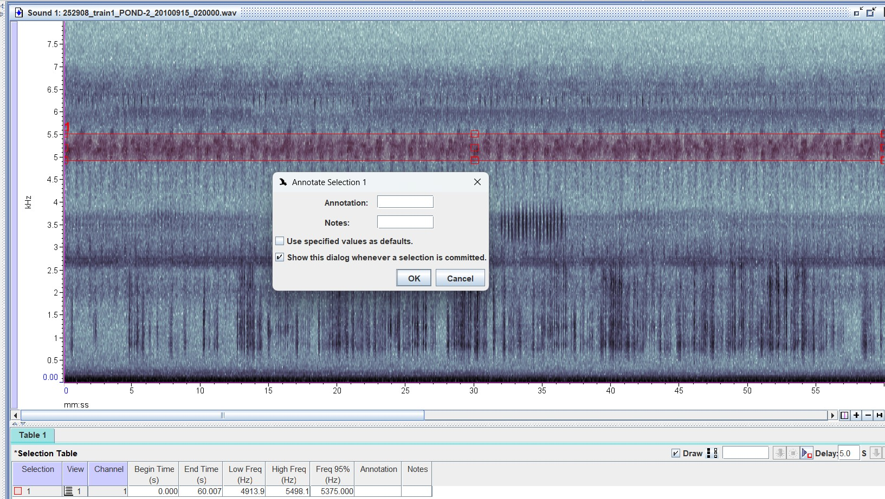

Let’s figure out how to ID this call at \~5-5.5 kHz. Open the [Orthoptera Call Guide](https://docs.google.com/spreadsheets/d/1klMWGWtpvWHylVUaaB9nnBOiFvXm6wb4ZrrdUU_eoO0/edit?usp=sharing) which is the first step one should take to ID a signal. This reference guide has all the possible stridulating Orthopterans in Eastern Texas.

## 2. Describe the sound

Box the signal. Play your selection using the `Filtered Play` function so that only the frequency range that is within the boxed signal is played. Describe the sound. Is it a chirp (or a chorus of chirps)—individual buzzy or chime-like notes, or is it a trill—a single and consistent note? It's best to decide this by sound and by visually inspecting the signal morphology. Sometimes chirping species chorus—many chirps happening at once—resulting in the signal morphology resembling a trill. In this case it's only possible to recognize the chorus as a chirping species by auditory recognition, so pay careful attention. Our selection appears to be a chorusing species—when zoomed, we can see many strong individual signals accumulating between \~5 and \~5.6 kHz.

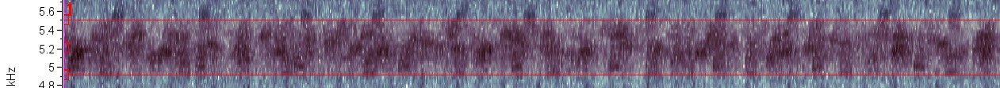

## 2. Consider the frequency range

We've established that our boxed signal might be described as many (chorusing) buzzy chirps that last \~0.5-1 second each. Now let's consider the frequency. Open the [Orthoptera Song Guide](https://docs.google.com/spreadsheets/d/1klMWGWtpvWHylVUaaB9nnBOiFvXm6wb4ZrrdUU_eoO0/edit?usp=sharing).

Look at the ***Frequency Column***. Open the links for any species that fall close to the frequency range of our boxed signal—considering the min to max frequency, or middle and 95% frequency. [This is why it's important to box signals accurately—including too much noise in the selection will make it very difficult to narrow down an ID based on frequency and sound]{.underline}. Each species has a link to the Singing Insects of North America (SINA) database. There will be variation when comparing the SINA recordings to our own. In most cases, the reference recordings on SINA are taken in a prefect environment whereas our field recordings will have variation in sound and frequency range—keep this in mind. Base your ID on multiple resources (see the **Resources** page) and types of ID support (e.g., sound, frequency, pulse rate). This rule will vary—some species are easier to ID by sound than others.

Put it all together: the signal in question is a chirping species that is chorusing. It is within the range of 5-5.6kHz, and it is giving off buzzy \~0.5-1 sec signals. Based on sound we might surmise that it could be *Orocharis saltator* or *Gryllus pennsylvanicus.*

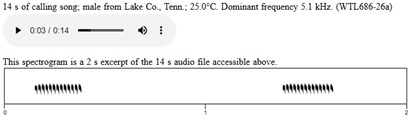

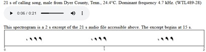

However*, G. pennsylvanicus* has a lighter, less buzzy sound than our signal and *O. saltator,* and typically occurs at a lower frequency. Therefore, we can be confident that there's no other species this signal can belong to other than *O. saltator.*

## 3. Enter ID information in the selection table

Enter our ID under the ***Annotation*** column. Since we’re confident in our ID, we don’t need a secondary ID in the **Notes** column. Make sure that the name in the ***Annotation*** column is consistent—‘*Genus_species*’ (i.e., *Orocharis_saltator*).

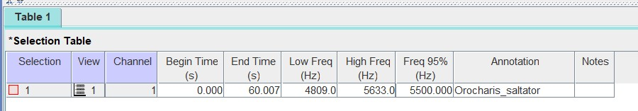

# Using the waveform

The waveform should be used as an auxiliary tool to help tell the difference between similar sounding species at similar frequencies, after considering sound, frequency, and signal morphology. It will be used to quantify the number of chirps per time unit (often per second) and the number of pulses within a single chirp visualized on an oscillogram—a graph showianyng sound amplitude across a time-series. The waveform is often useless for trilling species, since their signals have no clear breaks or variation in amplitude.

 in the first set of learning files.](images/tutorial/waveform1.jpg)

In the same spectrogram, select the chirping signal at 6.1 - 6.5 kHz. Take a moment to try and ID the signal by sound and frequency. In doing so, three species should be contenders: *Cycloptilum squamosum*, *Cycloptilum comprehendens*, and *Cyrtoxipha columbiana*.

Both genus' song sound similar and occur at similar frequencies. However, their pulsing rate is different—*Cycloptilum* has a pulse rate of 2 ps/chirp, and *Cyrtoxipha* has a pulse rate of \~4-5 ps/chirp. Let’s attempt to look at the chirp rate and pulse rate for this signal—box a small and clear portion of the signal.

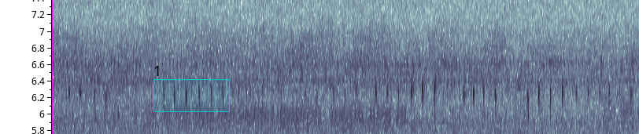

To filter a signal and view it on the waveform follow these steps:

1.  Box a noiseless portion of the overall signal (Figure 6).
2.  Click `edit` \> `band filter` \> `filter around active selection`.

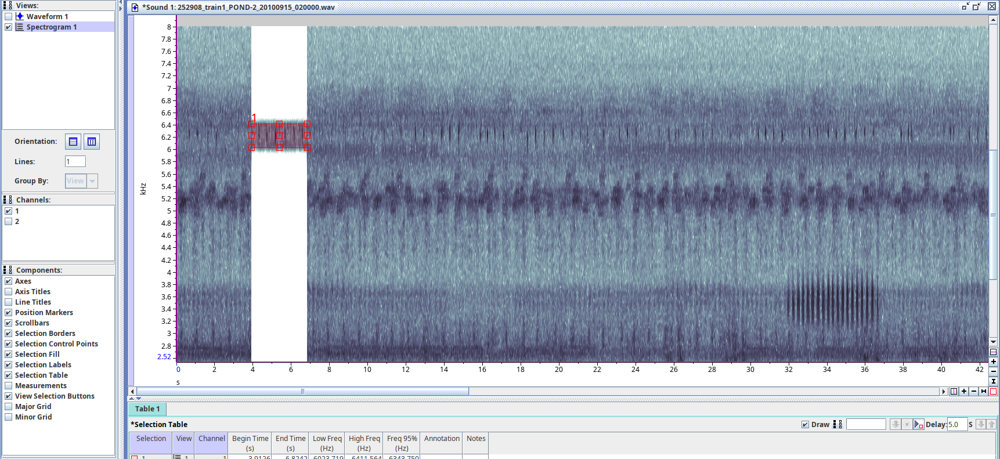

3.  Turn on the waveform. Click within the waveform to activate the window.
4.  Zoom vertically and horizontally until your filtered signal shows each individual pulse within a chirp.

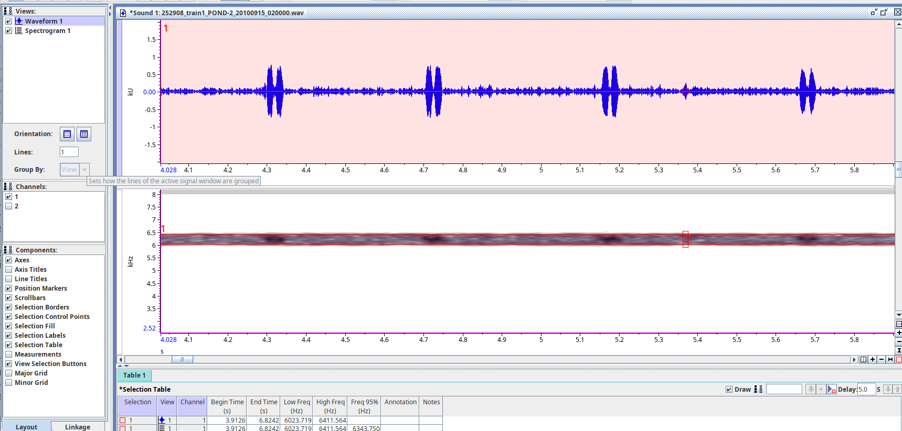

5.  Go to SINA or another resource, and compare the contending species with the waveform.

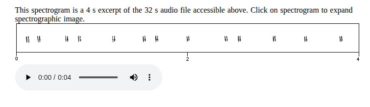

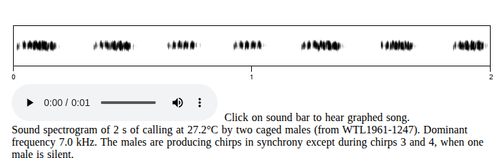

Although both genus sound similar and occur at a similar frequency, based on the number of pulses per chirp we can be certain based on the waveform that the acoustic signal in question belongs to *Cycloptilum.* It likely belongs to *Cycloptilum squamosum* over *Cycloptilum comprehendens* based on the sound and sound references available for these species—*C. comprehendens'*s tempo is two-beat, and *C. squamosum*'s tempo is one-beat. However we’ll include C. comprehendens as a note just in case, since there's not many references available for these species. [It’s always easier to include a note than to find the file later!]{.underline}

6.  Once the species is identified and/or you're done with the waveform, click `edit` \> `undo filter`. Restore the original zoom extent.

7.  Fill in the **Annotation** and **Notes** column accordingly.

Now it's your turn! Try to ID and annotate the rest of the acoustic signals in this file. After which we will check your answers and continue on to the rest of the learning files.

\*When finished make sure to:

1.  Save all your selections. i.e., make sure you click `enter` once a box is drawn and that the selection you made is static in the selection table when the next box is drawn.
2.  Save the selection table as the same base name as its corresponding sound file.
3.  Save the selection table alongside its corresponding sound file in the correct directory.

\*If you need any help with these last few steps please see the **Introduction to RavenPro** page.

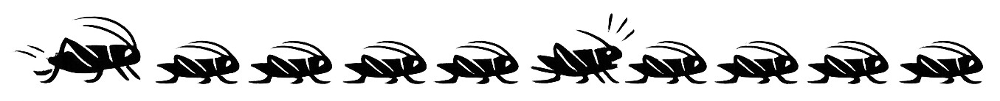
