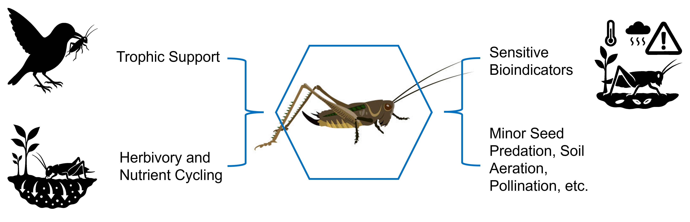
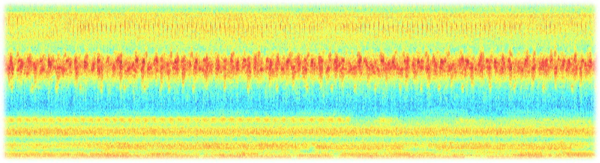
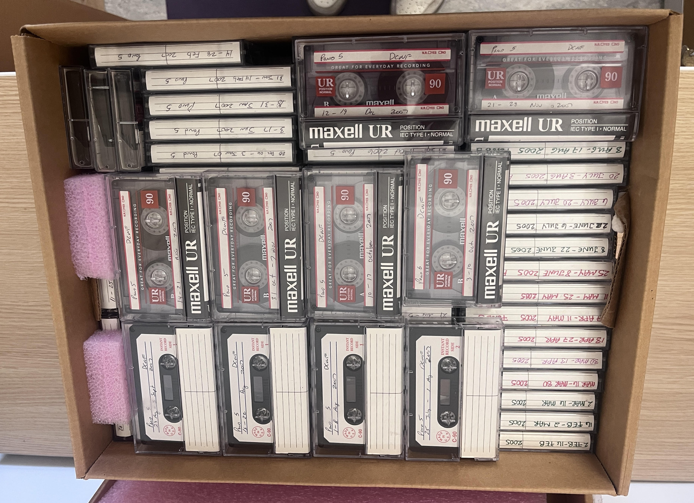

## How to use these docs

If it's your first time annotating and identifying Orthoptera, start with this brief background of the project and then the **Introduction to RavenPro** page. This website is a collection of resources to help new and existing annotators learn Orthoptera ID, use RavenPro, and annotate acoustic signals well enough to train a convolutional neural network (CNN) for automated ID.

## Project Background

Orthoptera (crickets, katydids, grasshoppers, locusts) are declining more rapidly than other insect taxa and are an important part of soundscapes, the collective noises in an ecosystem that can indicate its health. Orthoptera provide numerous ecosystem functions and services including nutrient cycling, trophic support as food sources, entomophagy, and seed dispersal. Because they are sensitive to environmental change, they are declining more rapidly than other insect groups, with estimates reaching 2.1-2.7% per year (Welti et al. 2020). This sensitivity also makes them good bioindicators (Riede 1998, McNeil and Grozinger 2020) to be used as a tool for broader conservation management (Menz et al. 2013). Despite their importance to ecosystem function, there is limited consistent and long-term monitoring data for Orthoptera, especially for nocturnal species (e.g. katydids and crickets).

We will leverage a 25-year time series dataset of soundscape recordings – originally meant to collect amphibian calls—collected by USDA biologists in eastern Texas to measure the trends in Orthopteran communities over the last two decades to build stronger conclusions about community change and suspected decline alongside other environmental drivers (e.g., climate and land use change).

\

As annotators, our objective is to apply a pre-trained convolutional neural network (CNN)—a form of AI—to automatically ID Orthopteran stridulation patterns in digital and analog recordings. The stridulation patterns look similar to the image below, where each band of energy has a morphological pattern and occurs at a given frequency between 0 and \~8 kHz.

The total dataset is \~ 7,200 hours, but our goal is to taxonomically identify a subset of the data (a few hundred hours) to teach the CNN model to identify the rest of the 7,200 hours of recordings. We will listen to and annotate a subset of recordings from a 25-year dataset using the [RavenPro](https://www.ravensoundsoftware.com/software/raven-pro/) sound analysis tool. The training data will feed into a pre-trained CNN network, [BirdNet](https://zenodo.org/records/8415090), originally developed for bird identification—both tools were developed by the [K. Lisa Yang Center for Conservation Bioacoustics](https://www.birds.cornell.edu/ccb/).

Oh, and recordings from 2000-2008 are in analog cassette format so we will be digitizing those as well! When completed this will be the largest consistent PAM dataset for Orthoptera in the world, and will inform conservation management endeavors for this taxa.

{width="847"}
