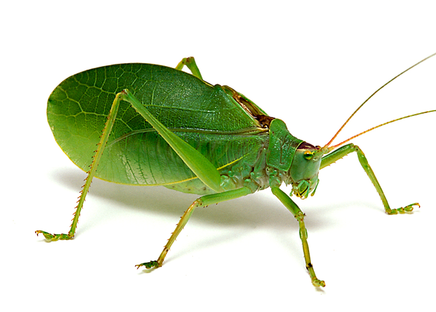

---
---
---

# Welcome to the Orthoptera Bioacoustics Docs

This is a collaborative project through the Grames Lab at Binghamton Univeristy to restore a long-term passive acoustic monitoring (PAM) dataset to better understand spatial and temporal patterns in the nocturnal Orthopterans (crickets and katydids) of eastern Texas.

Continue to the **About** page to get an introduction and background to the project.

